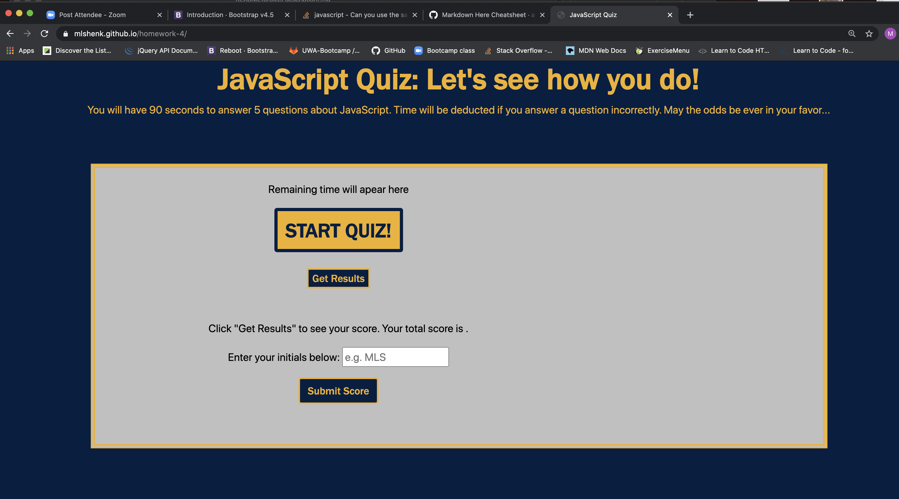
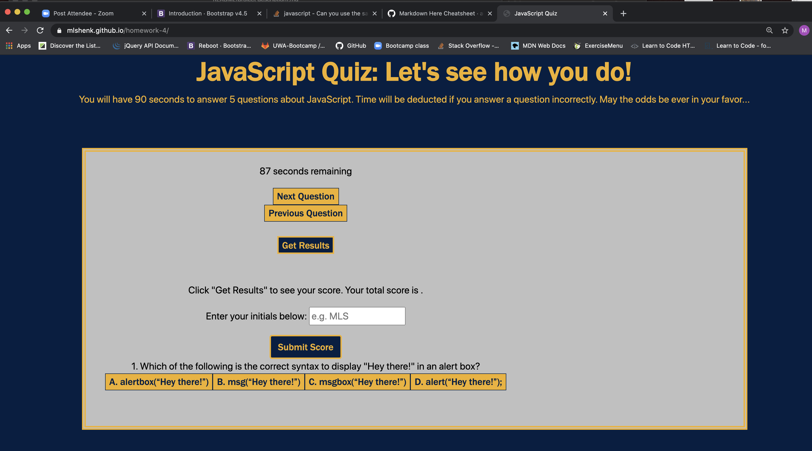
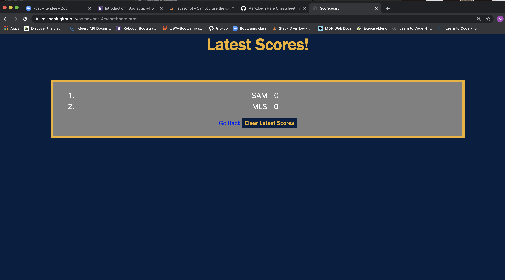

Github URL: https://mlshenk.github.io/homework-4/

This was certainly a challenging assignment! The task was to create a timed, interactive JavaScript coding quiz of at least four questions. When the user clicks the "Start Quiz" button, the quiz displays the first question and four answer choices. When the user selects an answer, an answer confirmation appears below the answer choice button and the user may proceed to the next question by pressing the "Next" button. The user may then click "Previous" to cycle back through questions. The user may select "Get Results" upon completion of the quiz to see their final score displayed above the text input field. The user is then prompted to enter in their initials and click "Submit Score" where they will be will be directed to another .html page with a score tracker. This score tracker displays the most recent scores by using the local storage feature. From this point, the user may go back to the quiz starting page or clear the latest scores.

